# Evolving Cellular Automata

[Repository](https://github.com/xcontcom/evolving-cellular-automata)

## Introduction

Hello, curious minds! Let’s explore the fascinating intersection of cellular automata and genetic algorithms to uncover emergent patterns and behaviors.

This article is a translation and adaptation of my 2019 piece, originally published in Russian on Habr: [Evolving Cellular Automata](https://habr.com/ru/articles/455958/). Here, we’ll dive into the mechanics of cellular automata, evolve them using genetic algorithms, and showcase some intriguing results.

### Cellular Automata Rules

The simplest form of cellular automata is the one-dimensional variant. (While zero-dimensional oscillators exist, we’ll set them aside for now.) In a one-dimensional cellular automaton, we start with a single array representing the initial state, where each cell holds a binary value (0 or 1). The next state of each cell depends on its current state and those of its two immediate neighbors, determined by a predefined rule.

With three cells (the cell itself and its two neighbors), there are 2^3 = 8 possible configurations:


For each configuration, we define the cell’s next state (0 or 1), forming an 8-bit rule, known as the Wolfram code. This results in 2^8 = 256 possible one-dimensional cellular automata.


Manually inspecting all 256 rules is feasible, but let’s scale up to two-dimensional cellular automata, where things get exponentially more complex.

In a two-dimensional automaton, we use a grid (matrix) instead of an array. Each cell has eight neighbors in a Moore neighborhood, including horizontal, vertical, and diagonal neighbors. (The Von Neumann neighborhood, excluding diagonals, is less commonly used.)


For consistency, we order the neighbors as follows:


With a cell and its eight neighbors, there are 2<sup>9</sup> = 512 possible configurations, and the rules are encoded as a 512-bit string. This yields 2<sup>512</sup> ≈ 1.34 × 10<sup>154</sup> possible two-dimensional automata — a number far exceeding the estimated ~10<sup>80</sup> atoms in the observable universe.


Exploring all these rules manually is impossible. If you checked one rule per second since the Big Bang, you’d have only covered \(4.35 \times 10^{17}\) by now. Enter genetic algorithms, which allow us to search for automata that meet specific criteria efficiently.

## Two-Dimensional Cellular Automata

Let’s build a two-dimensional cellular automaton. We’ll start by generating a random 512-bit rule:

```javascript
const rulesize = 512;
const rule = new Array(rulesize).fill(0).map(() => Math.round(Math.random()));
```

Next, we initialize an 89x89 grid (chosen for its odd dimensions to maintain dynamic behavior and computational efficiency):

```javascript
const sizex = 89;
const sizey = 89;
const size = 2;
const a = [];

for (let x = 0; x < sizex; x++) {
    a[x] = [];
    for (let y = 0; y < sizey; y++) {
        a[x][y] = Math.round(Math.random());
        if (a[x][y]) context.fillRect(x * size, y * size, size, size);
    }
}
```

To compute the next state, we use periodic boundary conditions (wrapping the grid into a torus shape to avoid edge effects):

```javascript
function countpoints() {
    const temp = new Array(sizex);
    for (let x = 0; x < sizex; x++) {
        temp[x] = new Array(sizey);
        const xm = (x - 1 + sizex) % sizex; // Wrap around using modulo
        const xp = (x + 1) % sizex;

        for (let y = 0; y < sizey; y++) {
            const ym = (y - 1 + sizey) % sizey;
            const yp = (y + 1) % sizey;

            // Calculate the bitmask in a single step
            let q = (
                (a[xm][ym] << 8) |
                (a[x][ym] << 7) |
                (a[xp][ym] << 6) |
                (a[xm][y] << 5) |
                (a[x][y] << 4) |
                (a[xp][y] << 3) |
                (a[xm][yp] << 2) |
                (a[x][yp] << 1) |
                a[xp][yp]
            );

            temp[x][y] = rule[q];
            if (temp[x][y]) context.fillRect(x * size, y * size, size, size);
        }
    }
    a = temp;
}
```

Running this automaton with a random rule often produces chaotic, white-noise-like behavior, akin to static on an untuned TV:


Let’s “tune” this TV using a genetic algorithm to find more structured patterns.

## Genetic Algorithm

Think of the genetic algorithm as tuning a TV to find a clear signal. Instead of manually adjusting knobs, we define desired properties, and the algorithm searches for rules that best match them. The vast number of possible automata ensures diverse outcomes with each run.

We’ll use a population of 200 automata, each defined by a 512-bit rule, stored in a `population[200][512]` array. We also track fitness scores for each individual:

```javascript
const PopulationSize = 200;
const rulesize = 512;
const population = [];
const fitness = [];

for (let n = 0; n < PopulationSize; n++) {
    population[n] = new Array(rulesize).fill(0).map(() => Math.round(Math.random()));
    fitness[n] = 0;
}
```

The genetic algorithm involves two key processes: **selection** and **evolution**.

### Selection
We evaluate each automaton’s fitness based on how well it meets our criteria. The top 50% (100 individuals) with the highest fitness survive, while the rest are discarded.

### Evolution
Evolution consists of **crossover** and **mutation**:

- **Crossover**: We pair surviving individuals to create offspring. For each pair, we select a random crossover point and swap genes to produce two new descendants:


- **Mutation**: We apply a 5% mutation rate, where each gene in an individual’s rule has a 5% chance of flipping (0 to 1 or vice versa). Higher mutation rates can introduce beneficial diversity but risk destabilizing successful traits.

Here’s the evolution function:

```javascript
function evolute() {
    const sizehalf = PopulationSize / 2;
    const sizequarter = sizehalf / 2;
    const arrayt = population.map((p, i) => [p, fitness[i]]);
    arrayt.sort((a, b) => b[1] - a[1]); // Sort by fitness, descending
    arrayt.length = sizehalf; // Keep top half
    const newPopulation = [];
    const newFitness = [];

    for (let i = 0; i < sizequarter; i++) {
        const i0 = i * 4;
        const i1 = i * 4 + 1;
        const i2 = i * 4 + 2;
        const i3 = i * 4 + 3;

        const removed1 = Math.floor(Math.random() * arrayt.length);
        const parent1f = arrayt.splice(removed1, 1)[0];
        const parent1 = parent1f[0];
        const removed2 = Math.floor(Math.random() * arrayt.length);
        const parent2f = arrayt.splice(removed2, 1)[0];
        const parent2 = parent2f[0];

        const qen = Math.floor(Math.random() * rulesize);
        const child1 = parent1.slice(0, qen).concat(parent2.slice(qen));
        const child2 = parent2.slice(0, qen).concat(parent1.slice(qen));

        newPopulation[i0] = parent1;
        newPopulation[i1] = parent2;
        newPopulation[i2] = child1;
        newPopulation[i3] = child2;

        newFitness[i0] = 0;
        newFitness[i1] = 0;
        newFitness[i2] = 0;
        newFitness[i3] = 0;
    }

    const mutation = document.getElementById("mutatepercent").value * 1;
    const m = 100 / mutation;
    for (let i = 0; i < PopulationSize; i++) {
        if (Math.random() * m < 1) {
            const gen = Math.floor(Math.random() * rulesize);
            newPopulation[i][gen] = newPopulation[i][gen] ? 0 : 1;
        }
    }

    population = newPopulation;
    fitness = newFitness;
}
```

*Note*: The original article used a single crossover point, but experiments suggest that multiple random crossover points or higher mutation rates (e.g., 25%) can improve evolution speed and quality. However, we’ll stick with the 5% mutation rate and single-point crossover for consistency with the original experiments.

## Experiments

To guide natural selection, we define fitness criteria for desirable automata and let the genetic algorithm optimize for them.

### Experiment 1: Static Patterns
Chaotic automata flicker like static. Let’s seek stable patterns by comparing the 99th and 100th states and counting unchanged cells as fitness. To avoid trivial solutions (e.g., all 0s or all 1s), we add a constraint: the difference between the number of 0s and 1s must be less than 100.

```javascript
function countfitness(array1, array2) {
    let sum = 0;
    let a0 = 0;
    let a1 = 0;
    for (let x = 0; x < sizex; x++) {
        for (let y = 0; y < sizey; y++) {
            if (array1[x][y] === array2[x][y]) sum++;
            if (array1[x][y] === 0) a0++;
            else a1++;
        }
    }
    return Math.abs(a0 - a1) < 100 ? sum : 0;
}
```

After 421 epochs, we found an optimal solution where all \(89 \times 89 = 7921\) cells remain unchanged:


- **Blue dots**: Best individuals per epoch.
- **Red dots**: Worst individuals meeting the second criterion.
- **Black dots**: Average fitness (including those failing the second criterion).

Gene pool (Y: individuals, X: genes):


The resulting automaton:


Running the algorithm again yields different stable patterns:


### Experiment 2: Pattern Matching
Let’s search for automata that produce specific patterns in a second-order Moore neighborhood (25 cells). We start with this pattern:


Since each cell’s state depends on only 9 neighbors, matching a 25-cell pattern is challenging. A random automaton at the 100th iteration shows no matches:


To make the search feasible, we:
1. Allow one mistake in pattern matching.
2. Check the last 50 states (iterations 51–100).
3. Drop the 0s vs. 1s constraint.

After 3569 epochs:


- **Y-axis**: Arbitrary fitness scale (~30 patterns found, compared to 7921 in the static case).
- **X-axis**: Epochs, with white lines at 500 and 1000.
- **Blue/red/black dots**: Best, worst, and average fitness.

Solutions at 500, 1000, and 3569 epochs:


Gene pool at 3569 epochs:


Dynamic behavior:


A single cell evolving into an oscillator:


Marking genes that form the oscillator (grey lines indicate unused genes):


Adding a constraint (difference between 0s and 1s ≤ 400) yields:


First 100 iterations:


Final iteration:


Tightening the constraint to ≤ 100 after 14865 epochs:


Scaled:


Dynamic behavior (50 iterations):


50th iteration:


### Experiment 3: Another Pattern
Targeting this pattern with exact matching:


After 3000 epochs:


Dynamic behavior (100 iterations):


100th iteration:


### Experiment 4: Precise Pattern Matching
For this pattern, we require exact Matches:


After 4549 epochs:


The solution at 4549 epochs, shown dynamically over 100 iterations:


After 500–2000 iterations, the automaton’s state becomes nearly fully ordered. The 89x89 grid size (chosen as an odd number) prevents complete ordering, maintaining some dynamic behavior:


However, with a 90x90 grid, the same automaton achieves full ordering:


Let’s examine the intermediate solution at 2500 epochs:


This automaton transforms a chaotic initial state into an ordered final state, characterized by a pattern shift left along the X-axis plus a few oscillator cells.

The ordering speed varies by grid size:
- A 16x16 automaton orders in approximately 100 iterations:


- A 32x32 automaton orders in about 1000 iterations:


- A 64x64 automaton orders in roughly 6000 iterations:


- A 90x90 automaton orders in about 370,000 iterations:


- An 11x11 (even-sized) automaton orders in approximately 178,700 iterations:


- A 13x13 automaton did not order within a reasonable timeframe.

On a 256x256 grid at the 100,000th iteration, the automaton displays remarkable self-organization:


Observing this self-organization process on a large field is captivating:

[Interactive visualization](http://xcont.com/cell/1/)

Rerunning the evolution yields different solutions, such as this one:


### Experiment 5: Next Pattern
Targeting this pattern, allowing one mistake in matching:


After 5788 epochs, the fitness graph (arbitrary scale):


Dynamic behavior of the automaton:


The ordered state consists of a pattern shifted upward along the Y-axis with a few oscillator cells:


Mutants in this population are particularly intriguing. Here’s one on a 256x256 grid over 200 iterations:


[Interactive visualization](http://xcont.com/cell/2/)

### Experiment 6: Complex Pattern (“habr”)
Original article was written on habr. For habr site I looked for specific pattern - letters "habr":


This pattern is a bit irrelevant here, but I made some experiments with this pattern and they quite interesting.

In previous experiments, we calculated the sum of cells around which the pattern is formed (if there was one error, 1 was added to the sum; if there were no errors, 2 were added). The resulting sum was used as a fitness coefficient for the genetic algorithm.

This method does not work for a more complex pattern. An automaton in which a smaller number of cells more accurately correspond to a given criterion (the number of cells that match the pattern in the vicinity of a cell) will lose every time to an automaton in which a larger number of cells less accurately correspond to a given criterion. As in the example with squares above:


For the desired pattern, on the 100th iteration of each automaton in the population, in the environment of each cell we will count the number of cells that match the pattern. We will take only the best result for each automaton. The number of cells that match the pattern will be used as the fitness coefficient. The pattern consists of 7x17=119 cells. This number will be considered the optimal solution. 6000 evolution cycles allowed us to find an automaton that draws a pattern with 5 errors (114 cells match the pattern).

Graph:


With 25% mutations, the gene pool is diverse:


Dynamic behavior:


Best solution at 100th iteration:


Original vs. found pattern:


Here another graph, that shows how the system evolves with different percent of mutations:


Red dots is average fitness, black dots - all individuals. Even with 100% mutants system evolves. But 25% gives us the best evolution process.

Let's make another experiment.

The same pattern as before. 5% of mutations, 1-8 genes mutate (random amount between 1 and 8). 100 epochs of evolution:


The graph is a heat map. The size of a point on the graph is 5 pixels. The origin (0,0) is the upper left corner.
The Y axis (from 0 to 100) is the evolution cycles. The X axis (from 0 to 119) is the number of cells matching the pattern (for each individual in the population, we take the best result). The brightness of the point is the number of individuals with the specified (X coordinate) result.

Let's run the genetic algorithm 4 times with the same parameters (100 cycles, 5% mutations, up to 8 genes mutate). The graph shows all 5 runs:


### Experiment 7: Improved Crossover
The original single-point crossover:


A more effective multi-point crossover:


Results with 5% and 25% mutations:


---

Using genetic algorithms to evolve cellular automata reveals a vast landscape of patterns and behaviors. From static grids to dynamic oscillators and complex shapes like “habr,” the interplay of selection, crossover, and mutation uncovers solutions that would be impossible to find manually. Experimenting with mutation rates and crossover methods highlights the robustness and flexibility of this approach, offering endless possibilities for discovery.

Try running these experiments yourself to find new patterns — each run is a new adventure!

[Repository](https://github.com/xcontcom/evolving-cellular-automata)

That's all for natural selection. For artificial selection, we'll use second-order cellular automata.

---

# Natural selection

---

## Second-order cellular automaton

Let us look at a zero-dimensional first-order cellular automaton (all the automata we discussed above are first-order).  
A zero-dimensional automaton consists of a single cell.  
The cell can be in one of two states, 0 or 1.  
Its next state at time t depends only on its state at time t−1.  
There are exactly four such zero-dimensional first-order automata (one of them is an oscillator):

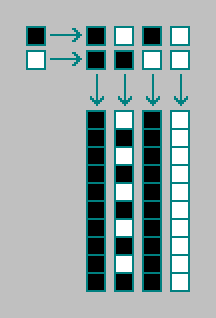

In a second-order cellular automaton, the next state of the cell at time t depends on both the current state at time t−1 and the previous state at time t−2.  
There are four possible combinations of two cell states.  
Hence 2^4 = 16 zero-dimensional second-order cellular automata:

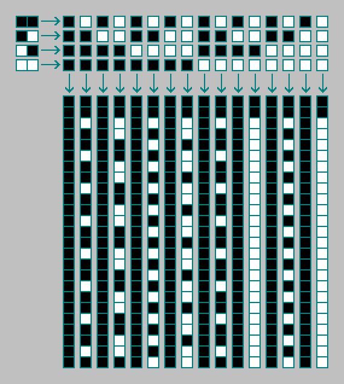

These automata already produce more complicated oscillators.

For third order there are 2^8 = 256 zero-dimensional automata:

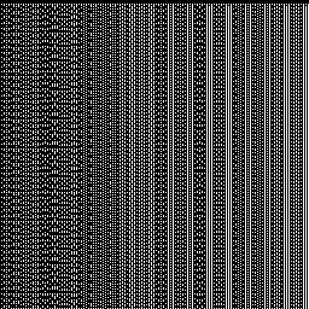

For fourth order we would have 2^16 = 65,536 zero-dimensional automata, which can’t be shown in a single picture.

Finding, for an n-th order automaton, a rule whose oscillation period is exactly n is a non-trivial and very interesting task. It deserves a separate article.

In a one-dimensional second-order cellular automaton the next state of a cell is determined by the current state of three cells (itself and its two neighbours, as usual) and by the previous state of the same cell:

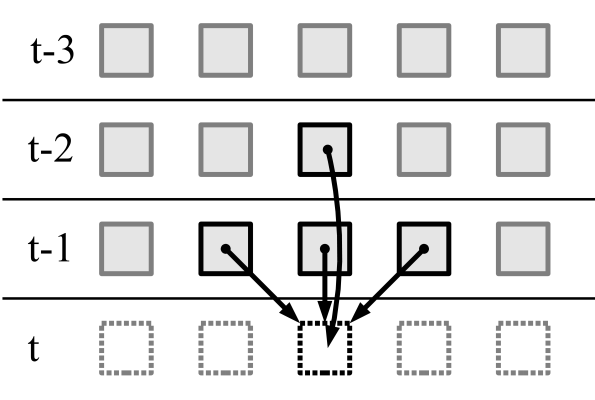

There are 2^16 = 65,536 one-dimensional second-order cellular automata.

Code (JavaScript):

```javascript
var rule = [];
for (var i = 0; i < 16; i++) rule[i] = Math.round(Math.random());

var a = [];
var b = [];
var temp;
for (var x = 0; x < sizex; x++) {
	a[x] = 0;
	b[x] = 0;
}
b[63] = 1;

var xm, xp, q;
for (var y = 2; y < sizey; y++) {
	temp = [];
	for (var x = 0; x < sizex; x++) {
		xm = x - 1;
		if (xm < 0) xm = sizex + xm;
		xp = x + 1;
		if (xp >= sizex) xp = xp - sizex;

		q = b[xm];
		q = (q << 1) + b[x];
		q = (q << 1) + b[xp];
		q = (q << 1) + a[x];

		temp[x] = rule[q];
		if (temp[x]) context.fillRect(x * size, y * size, size, size);
	}
	a = b;
	b = temp;
}
```

Second-order cellular automata produce more complex patterns than first-order ones.

Below are several random second-order rules (on each image, the left half shows the evolution from a single active cell at t−1, and the right half shows evolution from random states at t−1 and t−2; the binary code is the contents of the array `rule`):

0011111011001000:


0101101110011110:

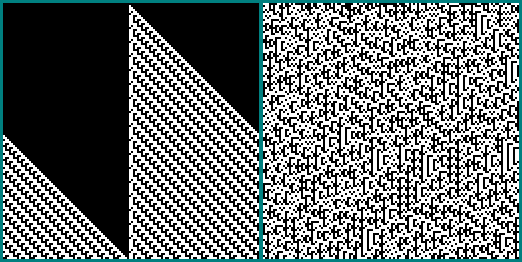

0110000110010010:

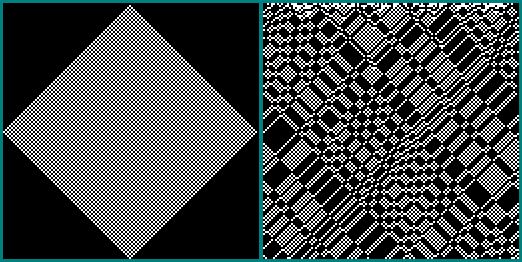

0110011010010110:

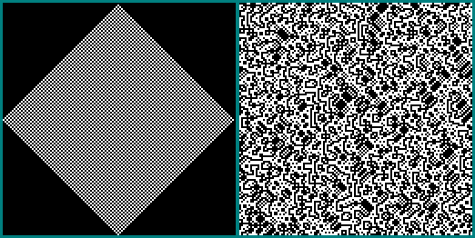

1110011010010110:

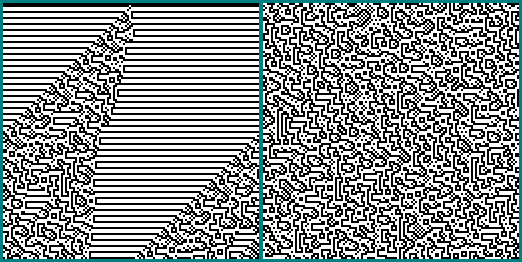

0110111010000101:

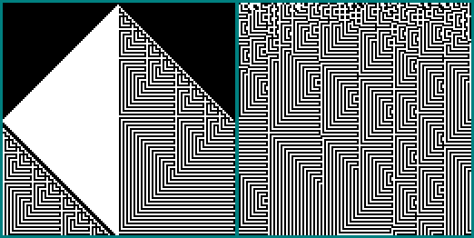

1111101001110110:

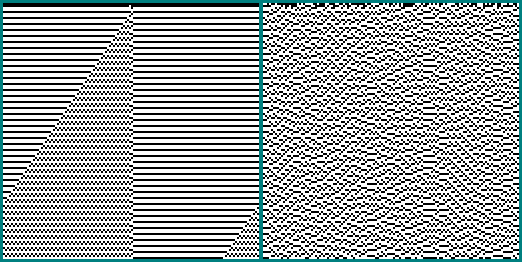

1001010001100000:

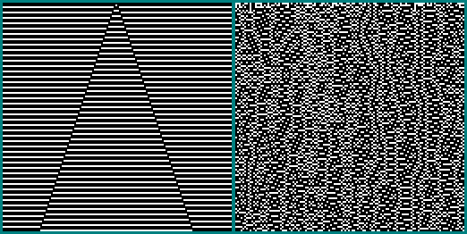

The same automaton as above on a 256×256 grid:

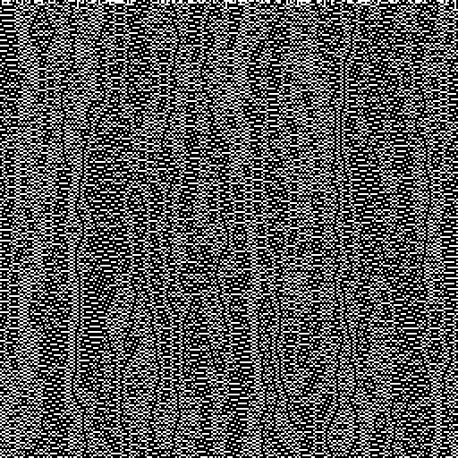

And on a 512×512 grid:

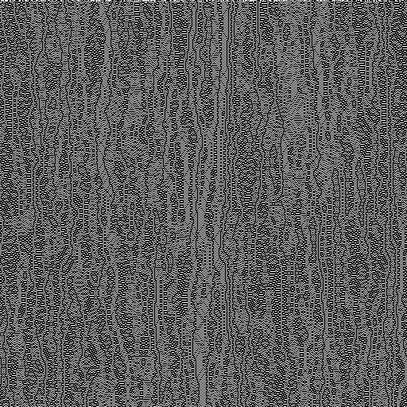

You can see more automata here:

[One-dimensional second-order CA](http://xcont.com/cell/2order/)  
[One-dimensional third-order CA](http://xcont.com/cell/3order/)

You can read more about one-dimensional second-order cellular automata in Stephen Wolfram’s book *A New Kind of Science*.

## Artificial selection

By analogy with the one-dimensional second-order automaton, in a two-dimensional second-order cellular automaton we also use one additional bit that encodes the cell’s state from time t−2.

For convenience we place this bit at the beginning of the binary string that represents the neighbourhood:

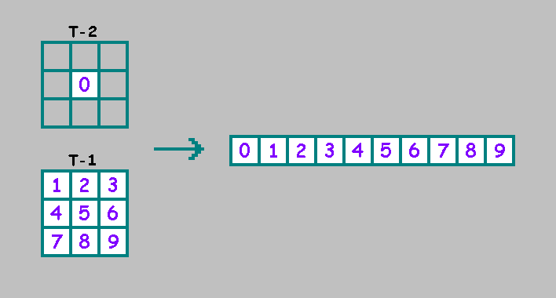

The convenience here is that if the first and second halves of the genotype coincide, then the automaton can be regarded as a first-order automaton:

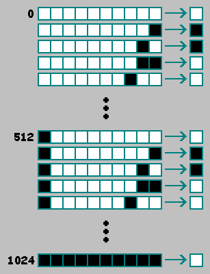

By adding just one additional cell (one bit from the previous state), we multiplied the number of possible automata by 2^512.  
The total number of second-order two-dimensional automata is therefore:

(2^512) × (2^512) = 2^1024.

In the previous sections, when we spoke about “natural selection”, we defined some explicit criterion and compared automata according to this criterion.

In the case of artificial selection we choose automata manually, using a very fuzzy heuristic: “this automaton looks interesting, that one doesn’t”.

This principle does not help much when we try to pick out the “best” automaton from a bunch of random ones:

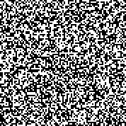

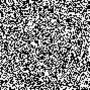

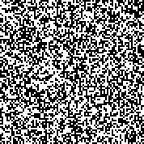


There are several ways to make the selection process more meaningful.  
Below I will describe four approaches.

### 1. Single active cell in the initial state

One approach is to observe the evolution of an automaton that starts from a single active cell in the initial configuration.

We create an initial population filled with random automata.  
A few examples from the initial population (30 iterations for each automaton):

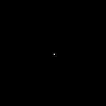


Within the population there is a small subset of automata that behave less chaotically.  
Those are the ones we will select for crossover:


Below are 20 random automata from the initial population (their states at iteration 30):

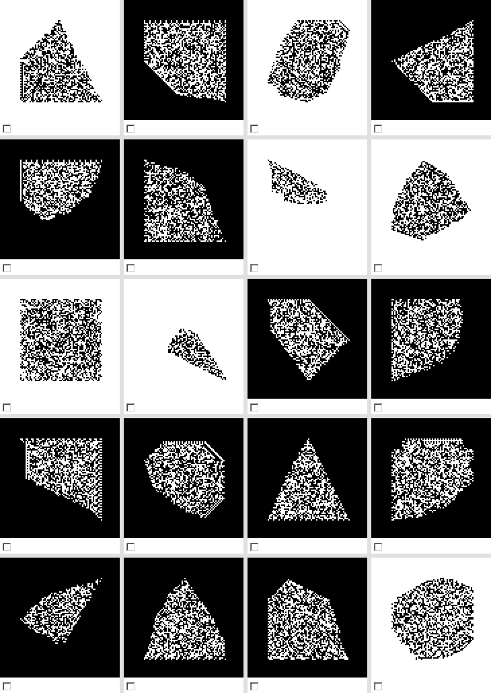

After three generations of evolution:

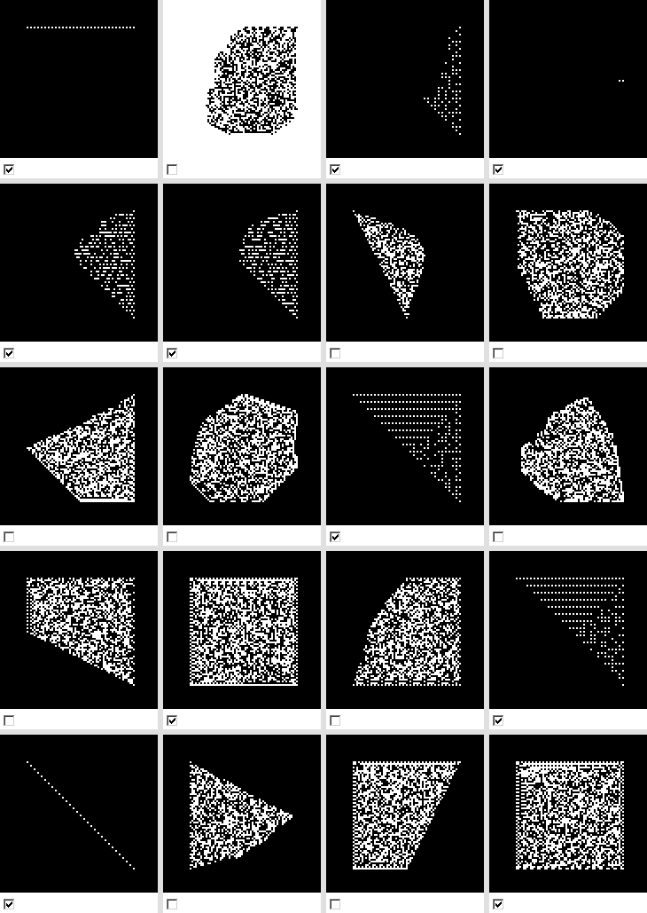

After eight generations of evolution:

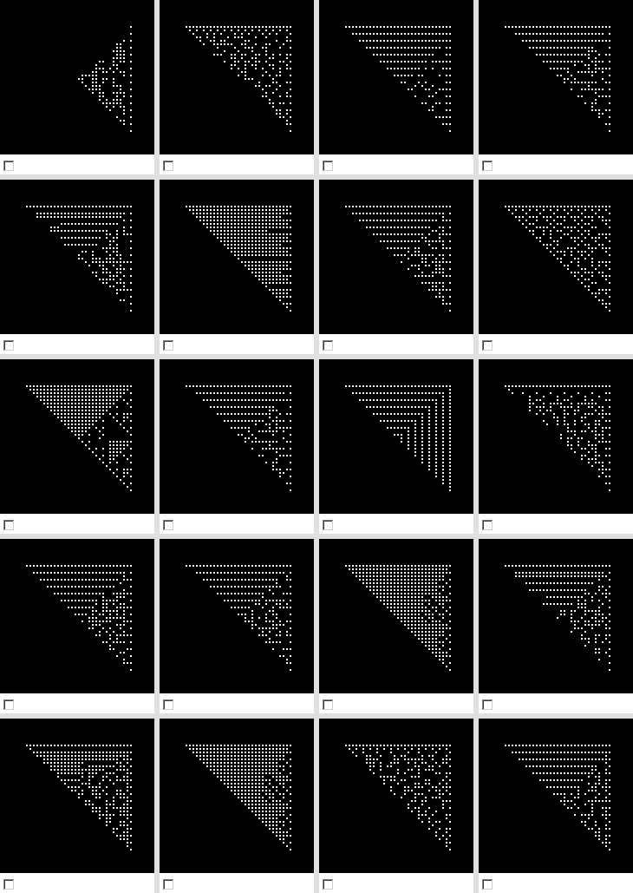

Eight generations were enough for the automaton with a particular visual feature (the one that draws triangles) to take over the entire population.

### 2. Partially filled genotype

If we change the balance between zeros and ones in the genotype, then the balance between zeros and ones in the phenotype (the actual configuration of the automaton) will also change.

The rule (genotype) of an automaton specifies the next state of a cell for every possible combination of the cell and its neighbours.  
If the genotype contains more zeros (or more ones), then in subsequent states of the automaton zeros (or ones) will gradually dominate.

It is interesting to look at the correlation between the proportion of ones and zeros in the genotype and the proportion of ones and zeros in the phenotype.

Let’s plot this relationship.

We create a series of populations, 200 automata in each.  
The genotype of each second-order automaton contains 1024 genes.  
For the first population we set all genes to zero.  
For each subsequent population we set n genes to one (the rest remain zero).  
For the first population n = 0, for the 513-th population n = 512.  

On the x-axis we put the population index.  
On the y-axis (white dots) we plot the ratio of ones to zeros in the gene pool of that population.  
We get a hyperbola:

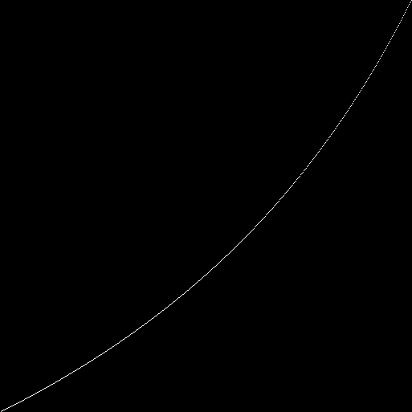

For each automaton (on a grid of size 89×89) we run 100 iterations.  
On the 100-th iteration we count the number of ones and zeros in the state (phenotype) of each automaton.  
On the graph we then plot the ratio of ones to zeros in the phenotypes (the total number of ones divided by the total number of zeros across all automata in the population).  
We get the following curve:

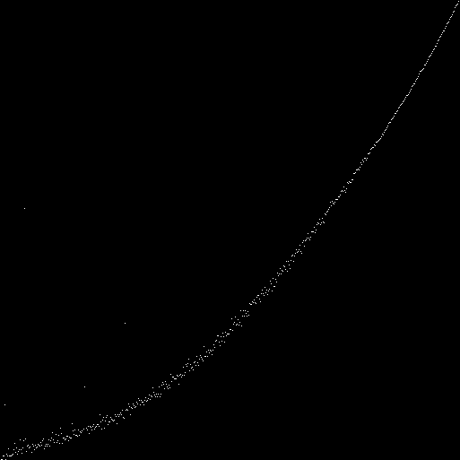

Instead of the total ratio over all phenotypes, we can also look at the ratio within each individual phenotype:


On the left side of the graph we can see points that deviate the most from the average value.  
We can hypothesize that these are precisely the automata whose 0-th gene is equal to one.  
Let’s test that hypothesis.  
We force the 0-th gene to always be zero and plot a new graph:

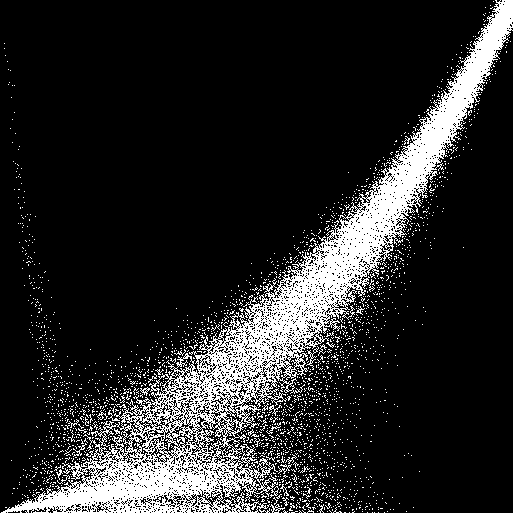

Now compare with the case where the 0-th gene is always equal to one:

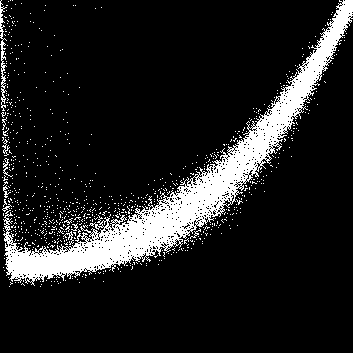

Second-order automata have another “zero” gene — number 512.  
Let us see how this gene affects the phenotype.

0-th and 512-th genes are always zero:


0-th gene is zero, 512-th gene is one:

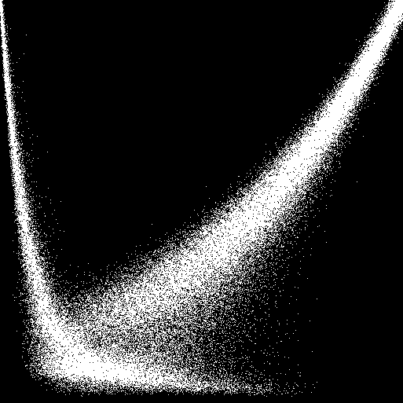

To avoid torturing photosensitive people with excessive flickering, in the genetic algorithm we will set both the 0-th and 512-th genes to zero in the initial population.

Now let us look at the automata we effectively removed by fixing genes 0 and 512 to zero.

The first 8 states of the automaton where only the 0-th gene is set (gene 0 = 1, all others are zero):

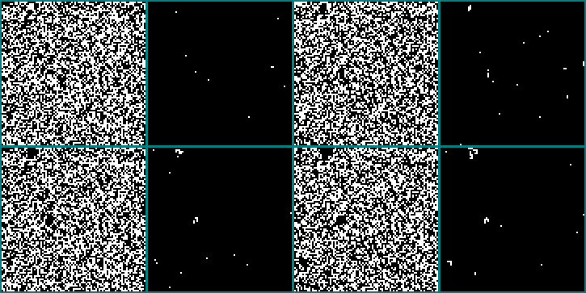

The automaton where only the 512-th gene is set:

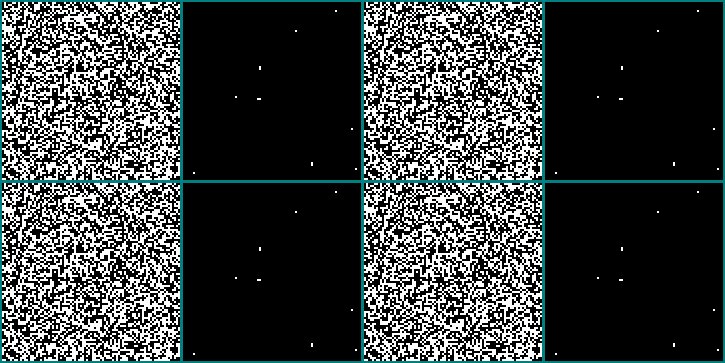

The automaton where only genes 0 and 512 are set:

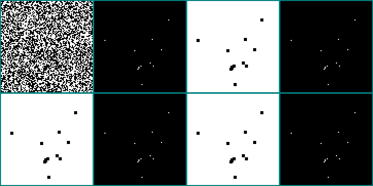

Now highlight on the graph the region where the population starts to split into distinct clusters:

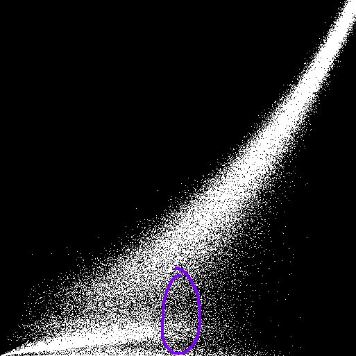

In this region the genotypes are 25% filled with ones.

Let’s compare two populations.

**First population.**  
30 random automata at iteration 1000.  
Genotypes are 50% filled (512 ones and 512 zeros):

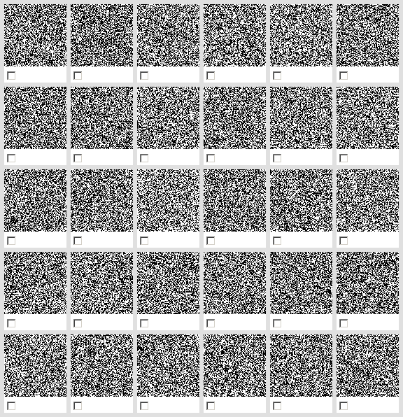

**Second population.**  
30 random automata at iteration 1000.  
Genotypes are 25% filled (256 ones and 768 zeros):

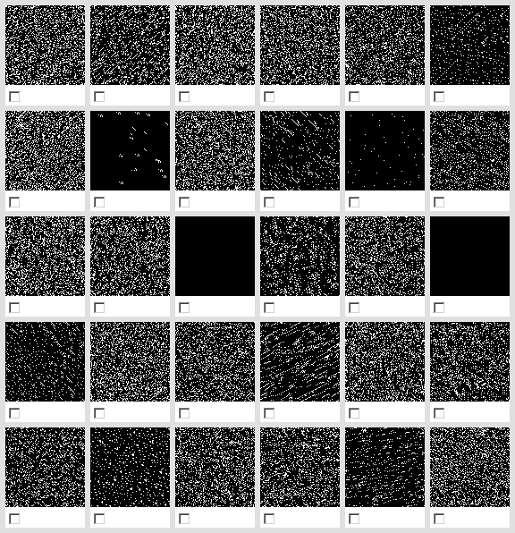

The second population is well suited for artificial selection.  
We can easily highlight certain visual traits in these automata—for example “darker ones”, “less chaotic ones” (where white cells cluster together), and so on.

Let us select the “darker” automata.  
Mutation probability is 10%, up to 4 genes mutate at a time.  
After the first selection step:

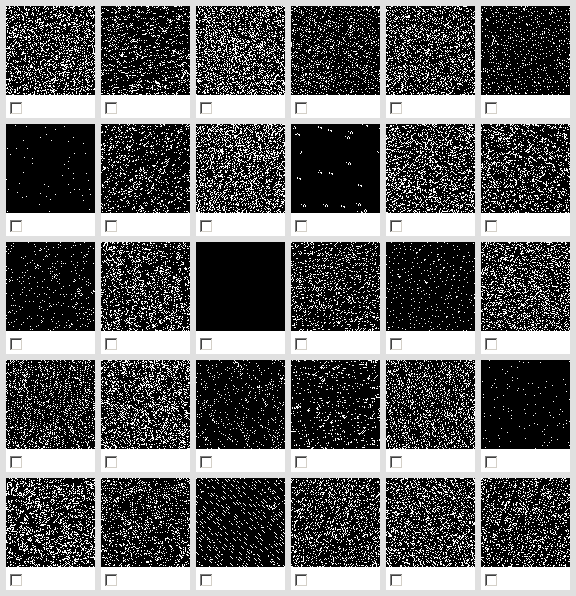

After the second selection step:

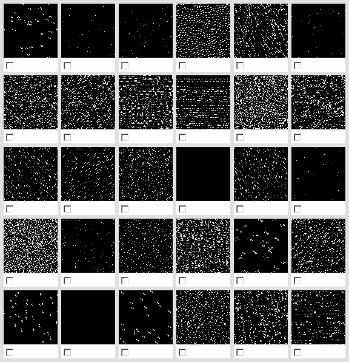

An interesting automaton has appeared in the population.

Here it is on a 256×256 grid, at iteration 1000:

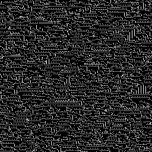

This automaton gradually takes over the population.

After the eighth selection step:

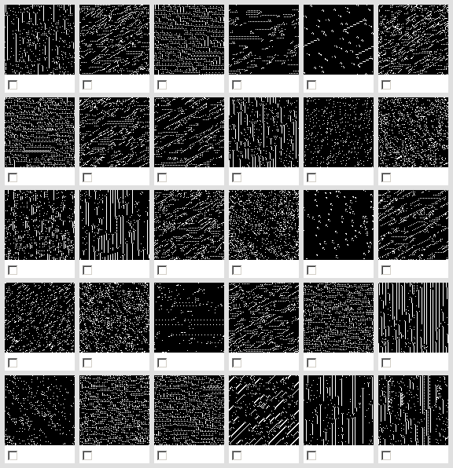

Another interesting automaton appears.

Again on a 256×256 grid, iteration 1000:

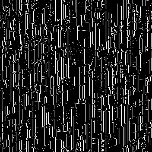

The population after thirteen selection steps:

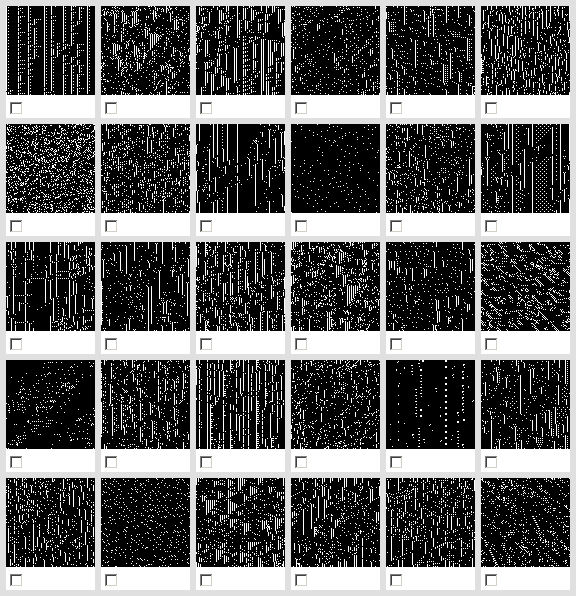

Below are several automata from this population.  
Each is shown on a 256×256 grid at iteration 1000.  
Under each picture there is a link where you can watch the automaton evolve in time:

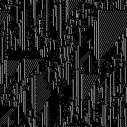

[Watch in dynamics](http://xcont.com/cell/2d_2order/0/)

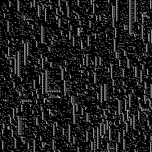

[Watch in dynamics](http://xcont.com/cell/2d_2order/1/)

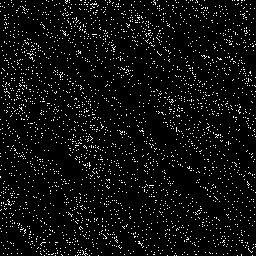

[Watch in dynamics](http://xcont.com/cell/2d_2order/2/)

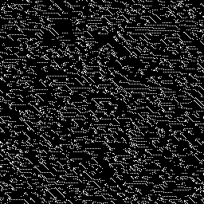

[Watch in dynamics](http://xcont.com/cell/2d_2order/3/)

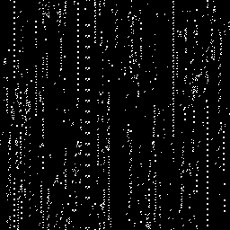

[Watch in dynamics](http://xcont.com/cell/2d_2order/4/)

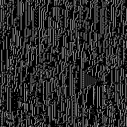

[Watch in dynamics](http://xcont.com/cell/2d_2order/5/)

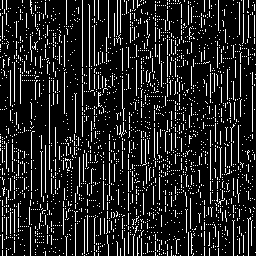

[Watch in dynamics](http://xcont.com/cell/2d_2order/6/)

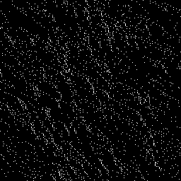

[Watch in dynamics](http://xcont.com/cell/2d_2order/7/)

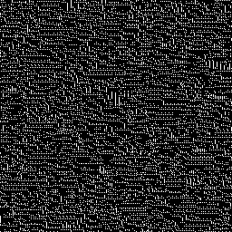

[Watch in dynamics](http://xcont.com/cell/2d_2order/8/)

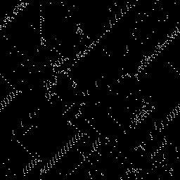

[Watch in dynamics](http://xcont.com/cell/2d_2order/9/)

### 3. Conway’s Game of Life and similar automata

The most famous two-dimensional first-order cellular automaton is Conway’s *Game of Life*.

Its rules can be stated as follows:  
– If a dead cell has exactly 3 live neighbours, it becomes alive (otherwise it stays dead).  
– If a live cell has 2 or 3 live neighbours, it survives (otherwise it dies).  
We represent a dead cell as 0 and a live cell as 1.

A cell can have between 0 and 8 live neighbours.  
There are therefore 9 possible neighbour counts around a dead cell and 9 around a live cell.  
We can encode these in an array `r`:

```javascript
r = [
	0,0,0,1,0,0,0,0,0,
	0,0,1,1,0,0,0,0,0
];
```

The first half of the array corresponds to a dead cell, the second half to a live cell.

We can now expand Conway’s rule for all possible (512) combinations of the cell and its 8 neighbours:

```javascript
r = [
	0,0,0,1,0,0,0,0,0,
	0,0,1,1,0,0,0,0,0
];
var rule = [];
var q1, q2;
for (var i = 0; i < 512; i++) {
	var ii = i.toString(2);
	for (var j = ii.length; j < 9; j++) ii = '0' + ii;
	q1 = 1 * ii[4];
	q2 = 1 * ii[0] + 1 * ii[1] + 1 * ii[2] + 1 * ii[3] + 1 * ii[5] + 1 * ii[6] + 1 * ii[7] + 1 * ii[8];
	if (q1 == 0)
		rule[i] = r[q2];
	else
		rule[i] = r[q2 + 9];
}
```

An optimized variant:

```javascript
r = [
	0,0,0,1,0,0,0,0,0,
	0,0,1,1,0,0,0,0,0
];
var rule = [];
for (var i = 0; i < 512; i++) {
	var q = ((i >> 4) & 1) * 8;
	for (var j = 0; j < 9; j++) {
		q += (i >> j) & 1;
	}
	rule[i] = r[q];
}
```

For the second-order version we simply copy the second half of the `rule` array from the first one:

```javascript
for (var i = 0; i < 512; i++) {
	if (rule[i] == 0)
		rule[i + 512] = 0;
	else
		rule[i + 512] = 1;
}
```

If we run the automaton with this rule, we see characteristic gliders and oscillators.  
Here are several iterations of this automaton:

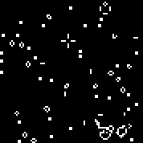

The array `r` has 18 entries.  
There are therefore 2^18 = 262,144 rules of “Conway-type” (i.e. rules that can be written in the same language: for which neighbour counts dead cells are born, and for which neighbour counts live cells die).  
You can explore these rules here:

[Conway-type automata](http://xcont.com/cell/conway/)  
(Conway’s rule is loaded by default; the “Change rule” button fills array `r` randomly.)

Here are some random automata of this type (the binary code shown under each picture is the contents of `r`):

110010011001111111

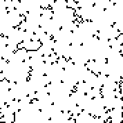

100001100110111110

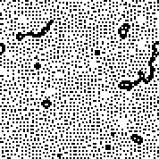

011111000100101110

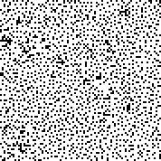

010000110000110010

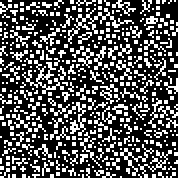

001111010011100111

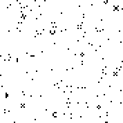

000111001000000110

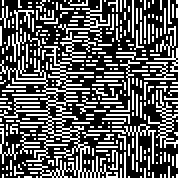

000101100010100001

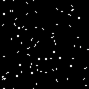

000001111101011111

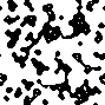

000001100110111111

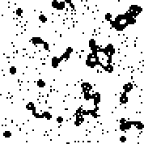

For the genetic algorithm we can use either the array `r` as the genotype (2^18 possible combinations), or the full array `rule` (2^512 combinations for a first-order automaton and 2^1024 combinations for a second-order automaton).

The space of 2^18 rules is relatively small.  
It is small enough that one can search it manually without a genetic algorithm (which is essentially what Conway did).

If, however, we fill the array `rule` with random Conway-type automata and use it as the genotype, then the experiment, to some extent, becomes unsuccessful (unsuccessful enough to not include those results here).  
The point is that Conway-type rules have a built-in symmetry.  
For example, for the following neighbourhood patterns:


… and for these ones:

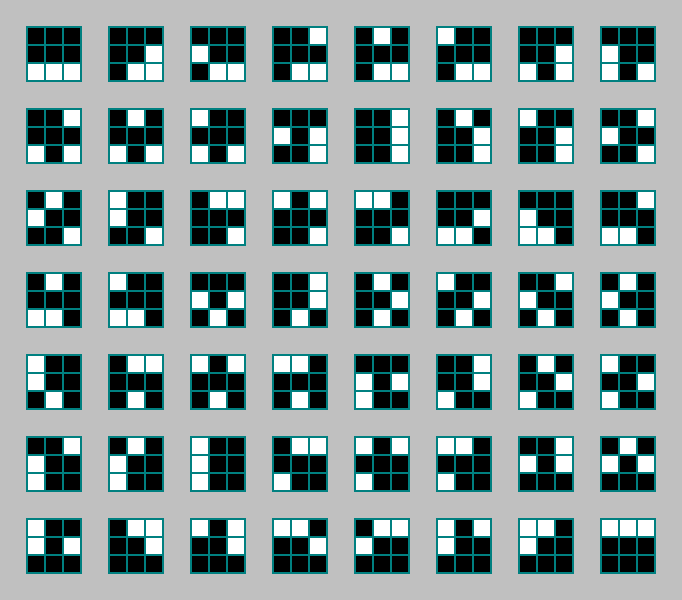

the next state of the central cell is the same.  
After the first crossover this symmetry is broken in the offspring rules.  
The parent rules accumulate mutations that also destroy the symmetry.  
Breaking the symmetry in the genotype destroys the symmetry in the phenotype as well.

We can see this symmetry in the phenotype if we start from a single live cell in the initial configuration.

Let’s run an experiment.  
To preserve symmetry, we will use the array `r` as the genotype.  
Mutation probability is 5%, one gene mutates at a time.  
The initial configuration contains a single live cell.

Below are 30 random automata from the initial population.  
Each image shows the state of the automaton at iteration 30:

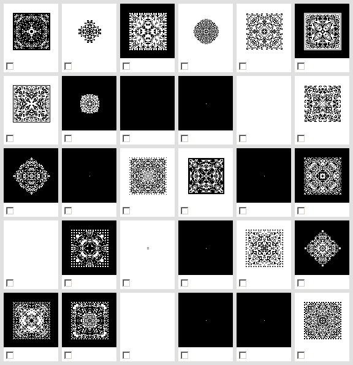

We will try to select automata that expand (grow) from a single live cell as slowly as possible.

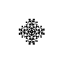


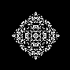

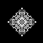

After the first selection step we get rid of automata that do not develop at all:

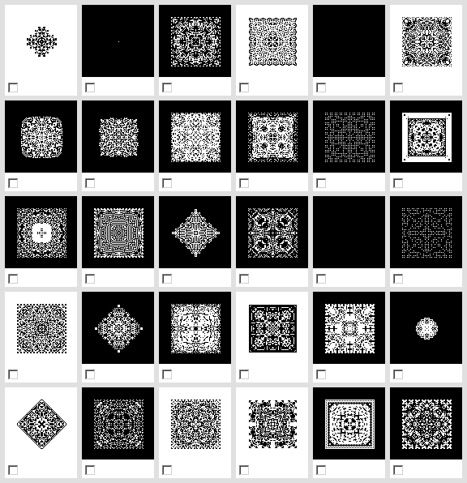

In the new population some non-developing automata still appear — these are unsuccessful offspring or mutants.

From this point on we will mostly select automata whose background remains white (cells that the wave front has not yet reached).

The black automata in these pictures are blinking.

If the 0-th gene is zero (if a cell with all black neighbours remains black), then all such automata expand at the same speed.  
Such automata do not match our selection criterion (minimal growth speed).  
The number of such rules decreases with each selection.  
If the 0-th gene is equal to one, then on the first (odd-numbered) iteration the background flips to white.  
Later the background may either stay white or blink (white on odd iterations, black on even ones).  
We do selection at iteration 30, which is even.  
By discarding automata with a black background at iteration 30, we also discard the blinking ones (again, out of respect for photosensitive viewers).

Population after the second selection step:

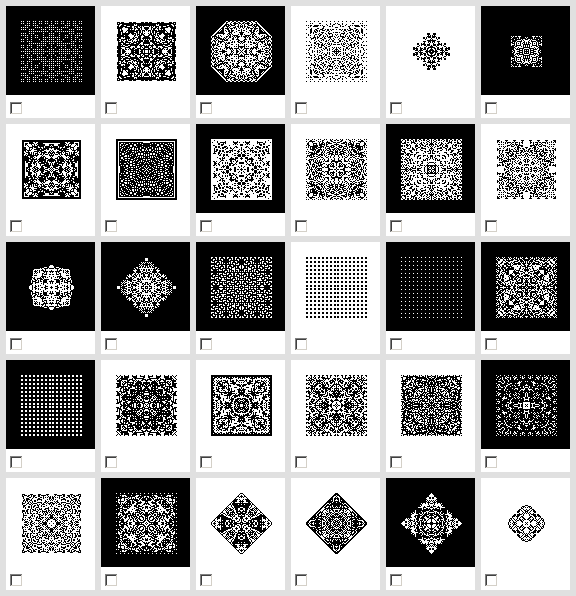

After 3 selections:

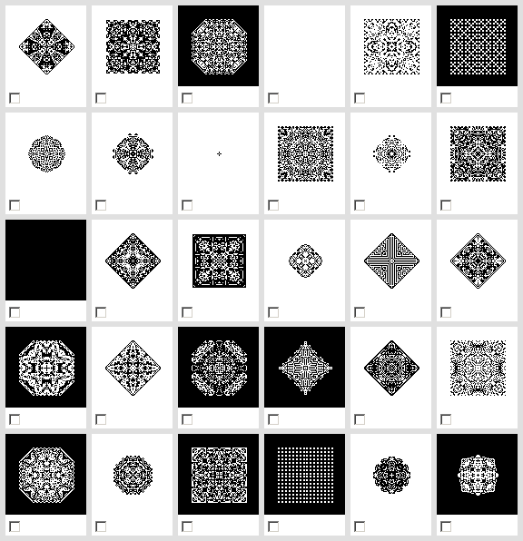

After 5 selections:

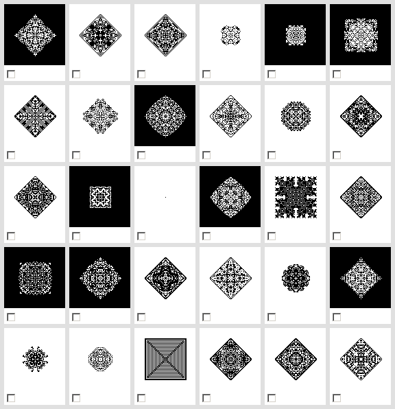

After 8 selections:

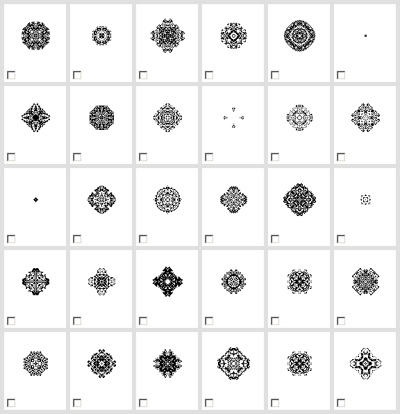

After 13 selections:

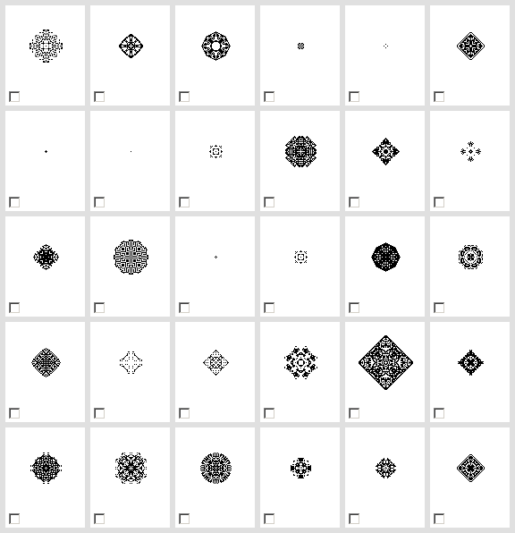

The same automata at iteration 60:

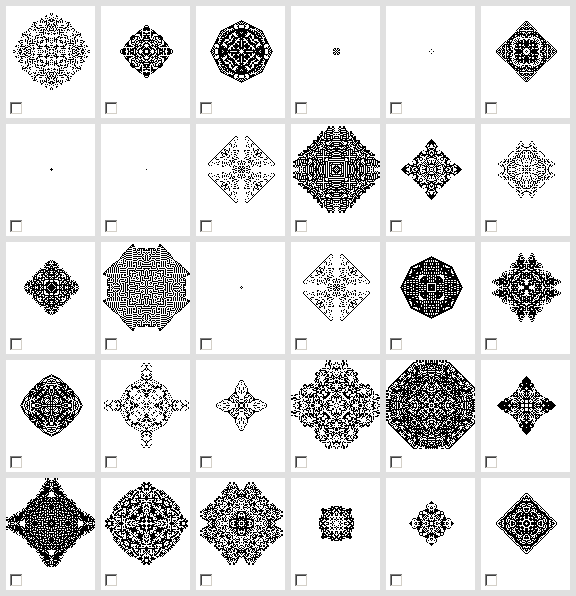

After 21 selections.  
States at iteration 30:

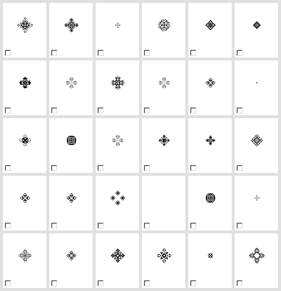

States at iteration 60:

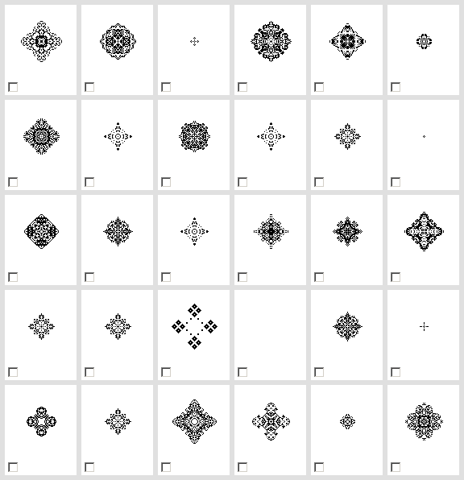

After 34 selections.  
States at iteration 30:


States at iteration 60:

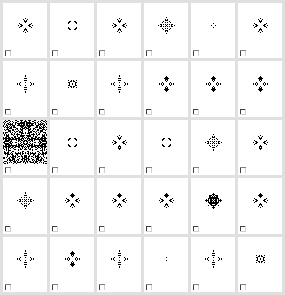

After that, the system essentially stops evolving.

Here are three automata from this final population (100 iterations each).  
Below each image is the corresponding array `r`:

[1,0,1,1,1,0,0,1,0,0,1,1,0,1,0,1,1,1]


[1,0,1,1,1,0,0,1,0,0,0,1,0,1,0,1,1,1]


[1,0,0,1,1,0,0,1,1,0,1,0,1,1,0,1,1,1]


For comparison, here is a random automaton:

[1,0,0,1,1,1,0,1,1,1,0,0,1,1,0,0,0,1]


### 4. Conway-type automata (variant 2)

In Conway-type rules we count the total number of live cells in the Moore neighbourhood.  
We can modify this by grouping the cells of the neighbourhood into four pairs and counting live cells within each pair:

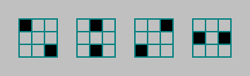

This increases the number of distinct rules while still preserving symmetry in the phenotype.

Each pair can contain 0, 1 or 2 live cells.  
There are four pairs.  
So there are 3^4 = 81 possible combinations for the neighbourhood of a dead cell, and 81 combinations for the neighbourhood of a live cell.  
In total we get 2^162 automata of this type.

The number

2^162 ≈ 5.846 × 10^48

is suitably astronomical and is large enough to serve as a search space for a genetic algorithm.

The genotype of each individual in our GA population has length 162 bits.

We initialize the population with random automata:

```javascript
var rulesize = 162;
for (var n = 0; n < PopulationSize; n++) {
	population[n] = [];
	fitness[n] = 0;
	for (var i = 0; i < rulesize; i++) {
		population[n][i] = Math.round(Math.random());
	}
}
```

Next we expand each such rule to all possible combinations of the central cell and its eight neighbours, filling an array `rule` for each individual:

```javascript
function fillrule() {
	var r;
	for (var n = 0; n < PopulationSize; n++) {
		rule[n] = [];
		r = population[n];
		var q1, q2, q3, q4, q5;
		var q;
		for (var i = 0; i < 512; i++) {
			var ii = i.toString(2);
			for (var j = ii.length; j < 9; j++) ii = '0' + ii;
			q1 = 1 * ii[4];
			q2 = 1 * ii[0] + 1 * ii[8];
			q3 = 1 * ii[1] + 1 * ii[7];
			q4 = 1 * ii[2] + 1 * ii[6];
			q5 = 1 * ii[3] + 1 * ii[5];
			q = parseInt('' + q2 + q3 + q4 + q5, 3);
			if (q1 == 0)
				rule[n][i] = r[q];
			else
				rule[n][i] = r[q + 81];
		}
	}
}
```

We use the array `rule` when computing the next state of each automaton.  
The function `fillrule()` is called once at page load and again after each call of `evolute()` (which performs reproduction and mutation).

The initial population looks chaotic.  
Here are 30 random automata at iteration 1000:

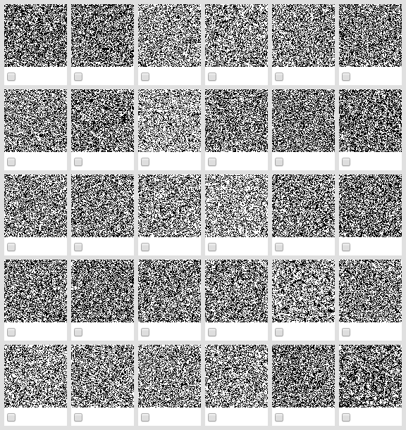

This chaos, however, is somewhat different from rule to rule when viewed dynamically, so the automata are still suitable for selection.  
But we can simplify the task and again select the “darkest” ones (those with the most live cells, if we render live cells as black).

Population after five selections:

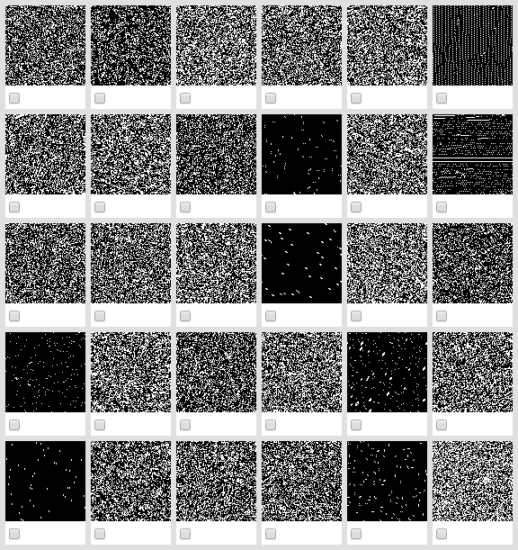

From here we can start looking for automata with the most complex oscillators.  
There is no point in showing the entire process in detail.  
Below are several of the most interesting automata found by the genetic algorithm.

Each image shows a 256×256 grid at iteration 10,000.  
Under each image there is a link where you can see the automaton evolve:

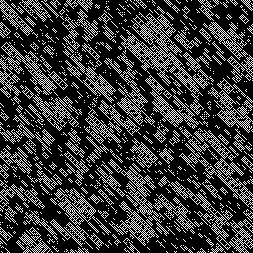

[Watch in dynamics](http://xcont.com/cell/conway2/0/)

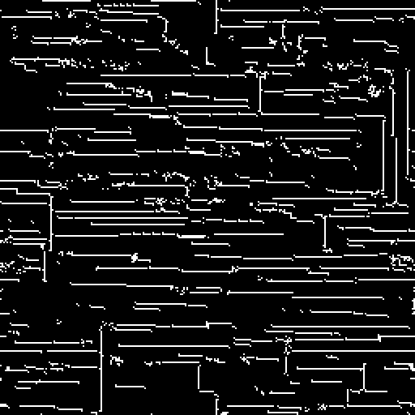

[Watch in dynamics](http://xcont.com/cell/conway2/1/)

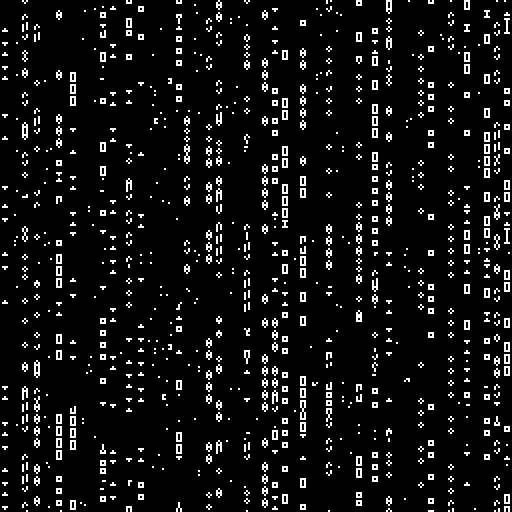

[Watch in dynamics](http://xcont.com/cell/conway2/2/)

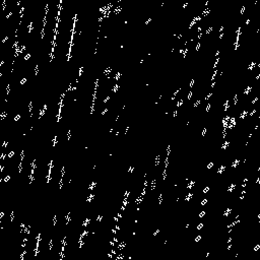

[Watch in dynamics](http://xcont.com/cell/conway2/3/)

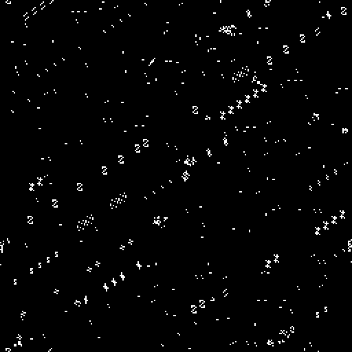

[Watch in dynamics](http://xcont.com/cell/conway2/4/)

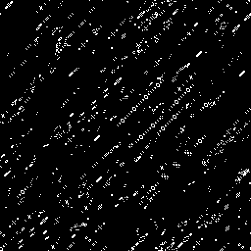

[Watch in dynamics](http://xcont.com/cell/conway2/5/)

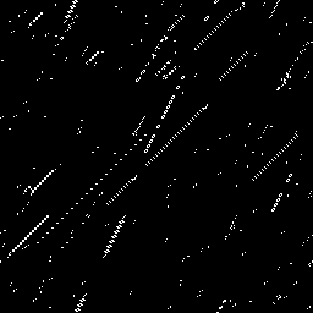

[Watch in dynamics](http://xcont.com/cell/conway2/6/)

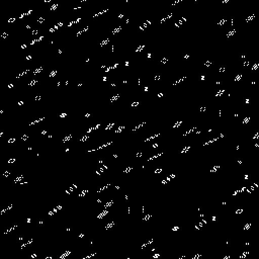

[Watch in dynamics](http://xcont.com/cell/conway2/7/)

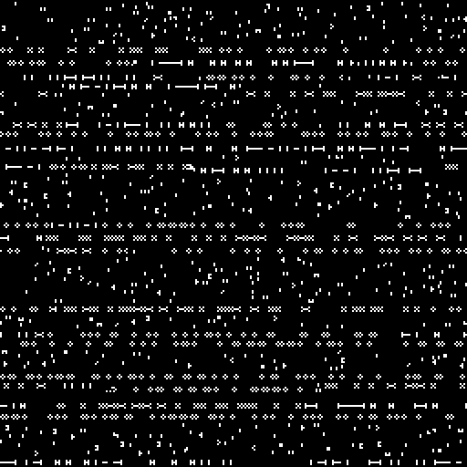

[Watch in dynamics](http://xcont.com/cell/conway2/8/)

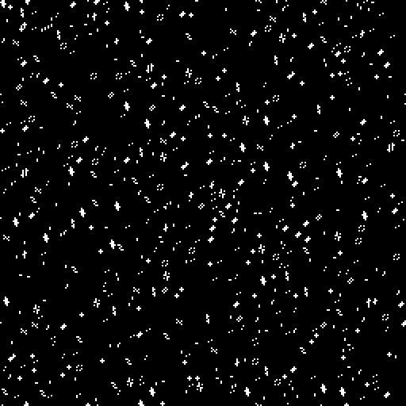

[Watch in dynamics](http://xcont.com/cell/conway2/9/)

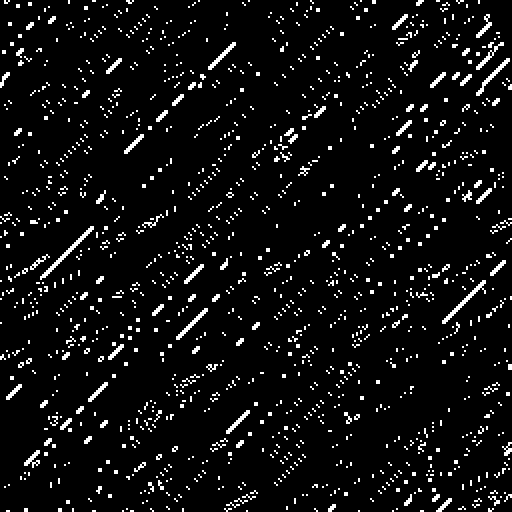

[Watch in dynamics](http://xcont.com/cell/conway2/10/)

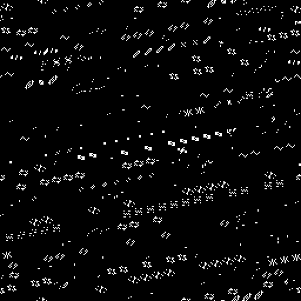

[Watch in dynamics](http://xcont.com/cell/conway2/11/)

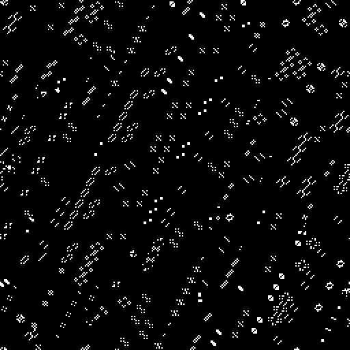

[Watch in dynamics](http://xcont.com/cell/conway2/12/)

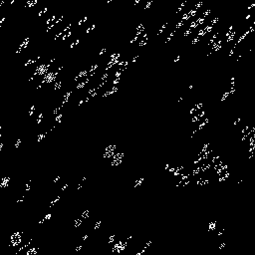

[Watch in dynamics](http://xcont.com/cell/conway2/13/)

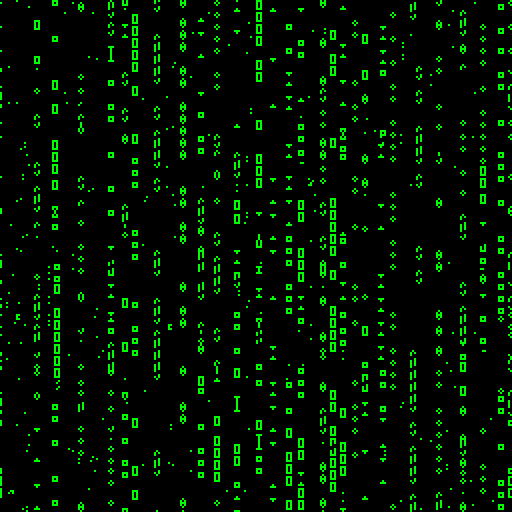

[Matrix-style rendering in green](http://xcont.com/cell/conway2/matrix/)  
[Slower version on a 512×512 grid](http://xcont.com/cell/conway2/matrix512/)

## Repository

[https://github.com/xcontcom/evolving-cellular-automata](https://github.com/xcontcom/evolving-cellular-automata)

## Conclusion

In this project we used a genetic algorithm to explore the enormous space of two-dimensional cellular automata.  
Already for first-order, two-state, two-dimensional automata there are 2^512 possible rules, and for second-order automata there are 2^1024.  
This is an astronomically large space: far more automata than there are atoms in the observable universe.

The famous Conway *Game of Life* is just one particular point in this space, and in fact belongs to a tiny, very special subclass of rules.  
When people hear “cellular automata”, they almost always think only of Conway’s automaton, without realizing how many other rules are possible and how rich their behaviour can be.  
The experiments in this article illustrate that even simple genetic selection, based on informal visual criteria (“less chaotic”, “darker”, “slower growth”, “more interesting oscillators”), is enough to discover a wide variety of non-trivial automata.

In this work we used the rule of the automaton itself as the genotype and tried to evolve rules that match some chosen criterion.

In the next project we will fix the rule (for example, Conway’s Game of Life or any other chosen rule) and instead use the *initial configuration* of the automaton as the genotype:

[https://github.com/xcontcom/initial-state-evolution](https://github.com/xcontcom/initial-state-evolution)

On a common toroidal grid we place two automata, A and B.  
The field is wrapped around horizontally for each automaton, and vertically the upper and lower boundaries of the two automata are shared—so each automaton interacts with the other along a common border.

As a fitness function for automaton A we use the state of automaton B at iteration n, and as the fitness function for B we use the state of A at iteration n.  
In other words, each automaton’s goal is to influence the configuration of its opponent (or partner).

Conway’s Game of Life is known to be Turing-complete; therefore, in principle, any algorithm or system of arbitrary complexity can be implemented within it.  
By co-evolving automata that compete (or cooperate) with each other, we hope to obtain increasingly complex patterns and behaviours.  
Unlike the current project, we will not prescribe a fixed target or end state.  
Instead, the “goal” of the system is the ongoing competition (or collaboration) between automata.  
This makes the evolutionary process more open-ended and may lead to structures that are unexpected and qualitatively different from what we would obtain by optimizing a manually chosen criterion.

---

## About the Author

Serhii Herasymov  
*Programmer & Math Enthusiast* (Ukraine → Ireland)  

Email: sergeygerasimofff@gmail.com  
GitHub: [xcontcom](https://github.com/xcontcom)  
X (Twitter): [@xcontcom](https://x.com/xcontcom)  

Feedback welcome.
