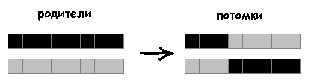

# Evolving Cellular Automata

[Repository](https://github.com/xcontcom/evolving-cellular-automata)

## Introduction

Hello, curious minds! Let’s explore the fascinating intersection of cellular automata and genetic algorithms to uncover emergent patterns and behaviors.

This article is a translation and adaptation of my 2019 piece, originally published in Russian on Habr: [Evolving Cellular Automata](https://habr.com/ru/articles/455958/). Here, we’ll dive into the mechanics of cellular automata, evolve them using genetic algorithms, and showcase some intriguing results.

### Cellular Automata Rules

The simplest form of cellular automata is the one-dimensional variant. (While zero-dimensional oscillators exist, we’ll set them aside for now.) In a one-dimensional cellular automaton, we start with a single array representing the initial state, where each cell holds a binary value (0 or 1). The next state of each cell depends on its current state and those of its two immediate neighbors, determined by a predefined rule.

With three cells (the cell itself and its two neighbors), there are \(2^3 = 8\) possible configurations:


For each configuration, we define the cell’s next state (0 or 1), forming an 8-bit rule, known as the Wolfram code. This results in \(2^8 = 256\) possible one-dimensional cellular automata.


Manually inspecting all 256 rules is feasible, but let’s scale up to two-dimensional cellular automata, where things get exponentially more complex.

In a two-dimensional automaton, we use a grid (matrix) instead of an array. Each cell has eight neighbors in a Moore neighborhood, including horizontal, vertical, and diagonal neighbors. (The Von Neumann neighborhood, excluding diagonals, is less commonly used.)


For consistency, we order the neighbors as follows:


With a cell and its eight neighbors, there are \(2^9 = 512\) possible configurations, and the rules are encoded as a 512-bit string, yielding \(2^{512} \approx 1.34 \times 10^{154}\) possible two-dimensional automata—a number far exceeding the estimated atoms in the observable universe (\(\sim 10^{80}\)).


Exploring all these rules manually is impossible. If you checked one rule per second since the Big Bang, you’d have only covered \(4.35 \times 10^{17}\) by now. Enter genetic algorithms, which allow us to search for automata that meet specific criteria efficiently.

## Two-Dimensional Cellular Automata

Let’s build a two-dimensional cellular automaton. We’ll start by generating a random 512-bit rule:

```javascript
const rulesize = 512;
const rule = new Array(rulesize).fill(0).map(() => Math.round(Math.random()));
```

Next, we initialize an 89x89 grid (chosen for its odd dimensions to maintain dynamic behavior and computational efficiency):

```javascript
const sizex = 89;
const sizey = 89;
const size = 2;
const a = [];

for (let x = 0; x < sizex; x++) {
    a[x] = [];
    for (let y = 0; y < sizey; y++) {
        a[x][y] = Math.round(Math.random());
        if (a[x][y]) context.fillRect(x * size, y * size, size, size);
    }
}
```

To compute the next state, we use periodic boundary conditions (wrapping the grid into a torus shape to avoid edge effects):

```javascript
function countpoints() {
    const temp = new Array(sizex);
    for (let x = 0; x < sizex; x++) {
        temp[x] = new Array(sizey);
        const xm = (x - 1 + sizex) % sizex; // Wrap around using modulo
        const xp = (x + 1) % sizex;

        for (let y = 0; y < sizey; y++) {
            const ym = (y - 1 + sizey) % sizey;
            const yp = (y + 1) % sizey;

            // Calculate the bitmask in a single step
            let q = (
                (a[xm][ym] << 8) |
                (a[x][ym] << 7) |
                (a[xp][ym] << 6) |
                (a[xm][y] << 5) |
                (a[x][y] << 4) |
                (a[xp][y] << 3) |
                (a[xm][yp] << 2) |
                (a[x][yp] << 1) |
                a[xp][yp]
            );

            temp[x][y] = rule[q];
            if (temp[x][y]) context.fillRect(x * size, y * size, size, size);
        }
    }
    a = temp;
}
```

Running this automaton with a random rule often produces chaotic, white-noise-like behavior, akin to static on an untuned TV:


Let’s “tune” this TV using a genetic algorithm to find more structured patterns.

## Genetic Algorithm

Think of the genetic algorithm as tuning a TV to find a clear signal. Instead of manually adjusting knobs, we define desired properties, and the algorithm searches for rules that best match them. The vast number of possible automata ensures diverse outcomes with each run.

We’ll use a population of 200 automata, each defined by a 512-bit rule, stored in a `population[200][512]` array. We also track fitness scores for each individual:

```javascript
const PopulationSize = 200;
const rulesize = 512;
const population = [];
const fitness = [];

for (let n = 0; n < PopulationSize; n++) {
    population[n] = new Array(rulesize).fill(0).map(() => Math.round(Math.random()));
    fitness[n] = 0;
}
```

The genetic algorithm involves two key processes: **selection** and **evolution**.

### Selection
We evaluate each automaton’s fitness based on how well it meets our criteria. The top 50% (100 individuals) with the highest fitness survive, while the rest are discarded.

### Evolution
Evolution consists of **crossover** and **mutation**:

- **Crossover**: We pair surviving individuals to create offspring. For each pair, we select a random crossover point and swap genes to produce two new descendants:



- **Mutation**: We apply a 5% mutation rate, where each gene in an individual’s rule has a 5% chance of flipping (0 to 1 or vice versa). Higher mutation rates can introduce beneficial diversity but risk destabilizing successful traits.

Here’s the evolution function:

```javascript
function evolute() {
    const sizehalf = PopulationSize / 2;
    const sizequarter = sizehalf / 2;
    const arrayt = population.map((p, i) => [p, fitness[i]]);
    arrayt.sort((a, b) => b[1] - a[1]); // Sort by fitness, descending
    arrayt.length = sizehalf; // Keep top half
    const newPopulation = [];
    const newFitness = [];

    for (let i = 0; i < sizequarter; i++) {
        const i0 = i * 4;
        const i1 = i * 4 + 1;
        const i2 = i * 4 + 2;
        const i3 = i * 4 + 3;

        const removed1 = Math.floor(Math.random() * arrayt.length);
        const parent1f = arrayt.splice(removed1, 1)[0];
        const parent1 = parent1f[0];
        const removed2 = Math.floor(Math.random() * arrayt.length);
        const parent2f = arrayt.splice(removed2, 1)[0];
        const parent2 = parent2f[0];

        const qen = Math.floor(Math.random() * rulesize);
        const child1 = parent1.slice(0, qen).concat(parent2.slice(qen));
        const child2 = parent2.slice(0, qen).concat(parent1.slice(qen));

        newPopulation[i0] = parent1;
        newPopulation[i1] = parent2;
        newPopulation[i2] = child1;
        newPopulation[i3] = child2;

        newFitness[i0] = 0;
        newFitness[i1] = 0;
        newFitness[i2] = 0;
        newFitness[i3] = 0;
    }

    const mutation = document.getElementById("mutatepercent").value * 1;
    const m = 100 / mutation;
    for (let i = 0; i < PopulationSize; i++) {
        if (Math.random() * m < 1) {
            const gen = Math.floor(Math.random() * rulesize);
            newPopulation[i][gen] = newPopulation[i][gen] ? 0 : 1;
        }
    }

    population = newPopulation;
    fitness = newFitness;
}
```

*Note*: The original article used a single crossover point, but experiments suggest that multiple random crossover points or higher mutation rates (e.g., 25%) can improve evolution speed and quality. However, we’ll stick with the 5% mutation rate and single-point crossover for consistency with the original experiments.

## Experiments

To guide natural selection, we define fitness criteria for desirable automata and let the genetic algorithm optimize for them.

### Experiment 1: Static Patterns
Chaotic automata flicker like static. Let’s seek stable patterns by comparing the 99th and 100th states and counting unchanged cells as fitness. To avoid trivial solutions (e.g., all 0s or all 1s), we add a constraint: the difference between the number of 0s and 1s must be less than 100.

```javascript
function countfitness(array1, array2) {
    let sum = 0;
    let a0 = 0;
    let a1 = 0;
    for (let x = 0; x < sizex; x++) {
        for (let y = 0; y < sizey; y++) {
            if (array1[x][y] === array2[x][y]) sum++;
            if (array1[x][y] === 0) a0++;
            else a1++;
        }
    }
    return Math.abs(a0 - a1) < 100 ? sum : 0;
}
```

After 421 epochs, we found an optimal solution where all \(89 \times 89 = 7921\) cells remain unchanged:


- **Blue dots**: Best individuals per epoch.
- **Red dots**: Worst individuals meeting the second criterion.
- **Black dots**: Average fitness (including those failing the second criterion).

Gene pool (Y: individuals, X: genes):


The resulting automaton:


Running the algorithm again yields different stable patterns:


### Experiment 2: Pattern Matching
Let’s search for automata that produce specific patterns in a second-order Moore neighborhood (25 cells). We start with this pattern:


Since each cell’s state depends on only 9 neighbors, matching a 25-cell pattern is challenging. A random automaton at the 100th iteration shows no matches:


To make the search feasible, we:
1. Allow one mistake in pattern matching.
2. Check the last 50 states (iterations 51–100).
3. Drop the 0s vs. 1s constraint.

After 3569 epochs:


- **Y-axis**: Arbitrary fitness scale (~30 patterns found, compared to 7921 in the static case).
- **X-axis**: Epochs, with white lines at 500 and 1000.
- **Blue/red/black dots**: Best, worst, and average fitness.

Solutions at 500, 1000, and 3569 epochs:


Gene pool at 3569 epochs:


Dynamic behavior:


A single cell evolving into an oscillator:


Marking genes that form the oscillator (grey lines indicate unused genes):


Adding a constraint (difference between 0s and 1s ≤ 400) yields:


First 100 iterations:


Final iteration:


Tightening the constraint to ≤ 100 after 14865 epochs:


Scaled:


Dynamic behavior (50 iterations):


50th iteration:


### Experiment 3: Another Pattern
Targeting this pattern with exact matching:


After 3000 epochs:


Dynamic behavior (100 iterations):


100th iteration:


### Experiment 4: Precise Pattern Matching
For this pattern, we require exact Matches:


After 4549 epochs:


The solution at 4549 epochs, shown dynamically over 100 iterations:


After 500–2000 iterations, the automaton’s state becomes nearly fully ordered. The 89x89 grid size (chosen as an odd number) prevents complete ordering, maintaining some dynamic behavior:


However, with a 90x90 grid, the same automaton achieves full ordering:


Let’s examine the intermediate solution at 2500 epochs:


This automaton transforms a chaotic initial state into an ordered final state, characterized by a pattern shift left along the X-axis plus a few oscillator cells.

The ordering speed varies by grid size:
- A 16x16 automaton orders in approximately 100 iterations:


- A 32x32 automaton orders in about 1000 iterations:


- A 64x64 automaton orders in roughly 6000 iterations:


- A 90x90 automaton orders in about 370,000 iterations:


- An 11x11 (even-sized) automaton orders in approximately 178,700 iterations:


- A 13x13 automaton did not order within a reasonable timeframe.

On a 256x256 grid at the 100,000th iteration, the automaton displays remarkable self-organization:


Observing this self-organization process on a large field is captivating:

[Interactive visualization](http://xcont.com/cell/1/)

Rerunning the evolution yields different solutions, such as this one:


### Experiment 5: Next Pattern
Targeting this pattern, allowing one mistake in matching:


After 5788 epochs, the fitness graph (arbitrary scale):


Dynamic behavior of the automaton:


The ordered state consists of a pattern shifted upward along the Y-axis with a few oscillator cells:


Mutants in this population are particularly intriguing. Here’s one on a 256x256 grid over 200 iterations:


[Interactive visualization](http://xcont.com/cell/2/)

### Experiment 6: Complex Pattern (“habr”)
Original article was written on habr. For habr site I looked for specific pattern - letters "habr":


This pattern is a bit irrelevant here, but I made some experiments with this pattern and they quite interesting.

In previous experiments, we calculated the sum of cells around which the pattern is formed (if there was one error, 1 was added to the sum; if there were no errors, 2 were added). The resulting sum was used as a fitness coefficient for the genetic algorithm.

This method does not work for a more complex pattern. An automaton in which a smaller number of cells more accurately correspond to a given criterion (the number of cells that match the pattern in the vicinity of a cell) will lose every time to an automaton in which a larger number of cells less accurately correspond to a given criterion. As in the example with squares above:


For the desired pattern, on the 100th iteration of each automaton in the population, in the environment of each cell we will count the number of cells that match the pattern. We will take only the best result for each automaton. The number of cells that match the pattern will be used as the fitness coefficient. The pattern consists of 7x17=119 cells. This number will be considered the optimal solution. 6000 evolution cycles allowed us to find an automaton that draws a pattern with 5 errors (114 cells match the pattern).

Graph:


With 25% mutations, the gene pool is diverse:


Dynamic behavior:


Best solution at 100th iteration:


Original vs. found pattern:


Here another graph, that shows how the system evolves with different percent of mutations:


Red dots is average fitness, black dots - all individuals. Even with 100% mutants system evolves. But 25% gives us the best evolution process.

Let's make another experiment.

The same pattern as before. 5% of mutations, 1-8 genes mutate (random amount between 1 and 8). 100 epochs of evolution:


The graph is a heat map. The size of a point on the graph is 5 pixels. The origin (0,0) is the upper left corner.
The Y axis (from 0 to 100) is the evolution cycles. The X axis (from 0 to 119) is the number of cells matching the pattern (for each individual in the population, we take the best result). The brightness of the point is the number of individuals with the specified (X coordinate) result.

Let's run the genetic algorithm 4 times with the same parameters (100 cycles, 5% mutations, up to 8 genes mutate). The graph shows all 5 runs:


### Experiment 7: Improved Crossover
The original single-point crossover:


A more effective multi-point crossover:


Results with 5% and 25% mutations:


## Conclusion
Using genetic algorithms to evolve cellular automata reveals a vast landscape of patterns and behaviors. From static grids to dynamic oscillators and complex shapes like “habr,” the interplay of selection, crossover, and mutation uncovers solutions that would be impossible to find manually. Experimenting with mutation rates and crossover methods highlights the robustness and flexibility of this approach, offering endless possibilities for discovery.

Try running these experiments yourself to find new patterns—each run is a new adventure!

[Repository](https://github.com/xcontcom/evolving-cellular-automata)
